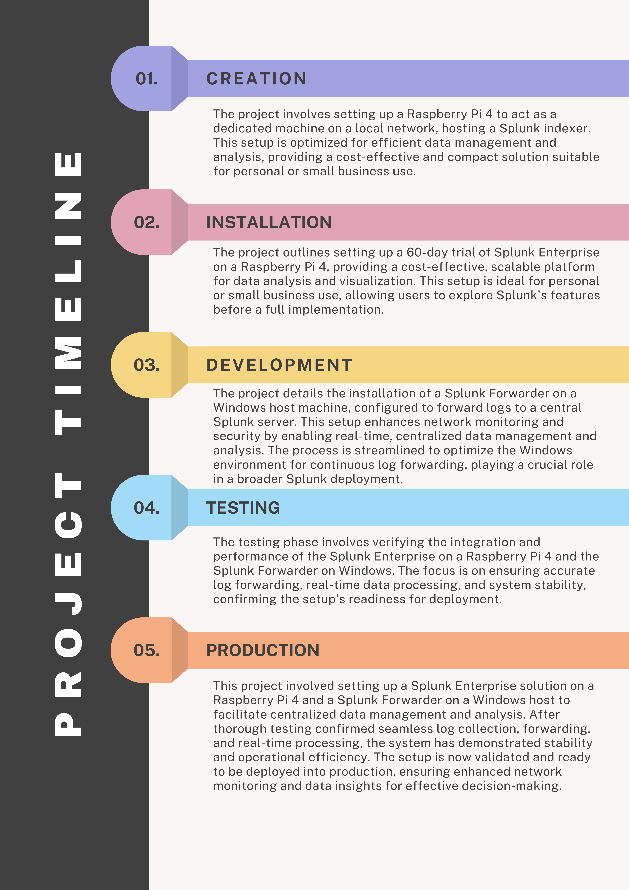

# Deploying a Splunk Indexer and Forwarder 🚀

  
*Visual representation of the project plan to deploy and forward logs to the Splunk Indexer.*

---

## 📋 Overview
This guide walks you through deploying a Splunk Indexer and Forwarder. We'll cover:

1. Setting up the Splunk Indexer.
2. Configuring the Splunk Forwarder.
3. Forwarding logs to the Indexer.

---

## 🛠️ Prerequisites

- A server for the Splunk Indexer (Linux/Windows).
- A server for the Splunk Forwarder (Linux/Windows).
- Access to both systems with administrative privileges.
- A Splunk Enterprise license (or free trial for testing).

---

## 1️⃣ Install Splunk Indexer

### 🔧 Step 1: Download Splunk
```bash
wget -O splunk.rpm 'https://www.splunk.com/page/download_track?file=8.2.3/linux/splunk-8.2.3.rpm'
```

### 🔧 Step 2: Install Splunk
```bash
sudo rpm -ivh splunk.rpm
```

### 🔧 Step 3: Start Splunk
```bash
sudo /opt/splunk/bin/splunk start --accept-license
```

### 🔧 Step 4 [Optional]: Enable Splunk to Start at Boot
```bash
sudo /opt/splunk/bin/splunk enable boot-start
```

### 🎉 Verify Installation
Access the Splunk Web Interface at `http://<your-indexer-ip>:8000`.

---

## 2️⃣ Install Splunk Forwarder

### 🔧 Step 1: Download the Universal Forwarder
```bash
wget -O splunkforwarder.rpm 'https://www.splunk.com/page/download_track?file=8.2.3/linux/splunkforwarder-8.2.3.rpm'
```

### 🔧 Step 2: Install the Forwarder
```bash
sudo rpm -ivh splunkforwarder.rpm
```

### 🔧 Step 3: Configure the Forwarder to Send Logs
```bash
sudo /opt/splunkforwarder/bin/splunk add forward-server <indexer-ip>:9997 -auth admin:changeme
```

### 🔧 Step 4: Add a Monitoring Path
```bash
sudo /opt/splunkforwarder/bin/splunk add monitor /var/log
```

### 🔧 Step 5: Start the Forwarder
```bash
sudo /opt/splunkforwarder/bin/splunk start
```

### 🎉 Verify Forwarder Logs
Check if logs are reaching the Indexer in the Splunk Web Interface.

---

## 3️⃣ Test the Setup

1. Log in to the Splunk Indexer Web Interface.
2. Search for logs using the query:
   ```spl
   index=<your-index>
   ```
3. Confirm that logs from the Forwarder are visible.

---

## 🤝 Wrapping Up
You now have a functional setup with:

- A Splunk Indexer collecting logs.
- A Splunk Forwarder sending logs.

Keep exploring Splunk's powerful analytics capabilities! ✨

---

## 📘 Resources
- [Splunk Documentation](https://docs.splunk.com)
- [Community Forums](https://community.splunk.com)
- [Splunk Training](https://www.splunk.com/en_us/training.html)

---

## 🌟 Feedback
Found this guide helpful? Give it a ⭐ on GitHub or share your thoughts!

